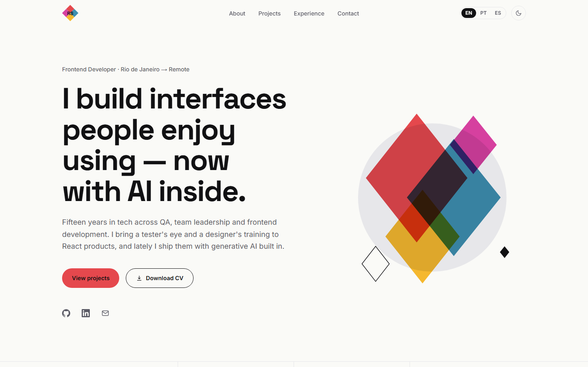

# Rebecca Souza — Portfolio

Personal portfolio of Rebecca Souza, frontend developer. One page, three languages, light and dark themes.



## Stack

- **Next.js 16** (App Router, React 19) with **TypeScript** in strict mode
- **Tailwind CSS 4**, with every color, font and size defined as a design token
- **next-intl** for English (default), Portuguese and Spanish
- **next-themes** for the light/dark toggle
- **Vitest** and **React Testing Library**
- **ESLint** and **Prettier**
- Deployed on **Vercel**

## Getting started

Requires Node.js 22 and Yarn 1.

```bash
yarn install
yarn dev
```

Open http://localhost:3000. You are redirected to `/en`, `/pt` or `/es` based on your browser language.

| Command           | What it does                           |
| ----------------- | -------------------------------------- |
| `yarn dev`        | Start the dev server                   |
| `yarn build`      | Production build                       |
| `yarn start`      | Serve the production build             |
| `yarn test`       | Run the test suite once                |
| `yarn test:watch` | Run tests in watch mode                |
| `yarn lint`       | ESLint                                 |
| `yarn typecheck`  | TypeScript, no emit                    |
| `yarn format`     | Prettier (also sorts Tailwind classes) |

Set `NEXT_PUBLIC_SITE_URL` to the production URL so canonical links, the sitemap and Open Graph tags are absolute. On Vercel it falls back to the project's production domain.

## Project structure

```
src/
  app/
    [locale]/        layout (metadata, fonts, providers), page, Open Graph image
    globals.css      design tokens
    sitemap.ts, robots.ts
  components/
    layout/          Header, MobileDrawer, LocaleSwitcher, ThemeToggle, Footer
    sections/        Hero, Stats, About, Projects, Experience, Skills, Contact
    ui/              Diamond, ButtonLink, Chip, Badge, BrowserFrame, Reveal, CopyEmailButton
  data/              projects, experience, skills (typed)
  i18n/              routing, navigation, request config
  messages/          en.json, pt.json, es.json
  proxy.ts           locale detection and redirect
```

## Technical decisions

**Design tokens only.** `globals.css` clears Tailwind's default palette (`--color-*: initial`) and defines the site's own tokens. A class like `text-gray-500` does not exist, so an off-palette color cannot reach the markup. Light and dark values are CSS variables switched by a `.dark` class.

**Accessible red.** The brand red `#E5484D` with white text has a contrast ratio of about 3.7:1, below WCAG AA. The primary button uses dark text on red (4.8:1), and text links use a darker red in light mode and a lighter one in dark mode.

**Typed translations.** `global.d.ts` registers `en.json` as the message type, so a mistyped translation key is a compile error. A test also checks that `pt.json` and `es.json` have exactly the same keys as `en.json`.

**Data separate from copy.** Projects, roles and skills live in typed files under `src/data`. Translatable text lives in the message files, keyed by the data's id. The id type is derived from the message file, so a project without a description fails type checking.

**Server components by default.** Only the pieces that need the browser are client components: the header (scroll state), locale switcher, theme toggle, mobile drawer, copy button, hero parallax and scroll reveal.

**Native `<dialog>` for the mobile menu.** It provides focus trapping, Escape to close and a backdrop without extra JavaScript.

**Motion in CSS.** Scroll reveal and the hero parallax are gated behind `prefers-reduced-motion: no-preference`. With reduced motion, content is simply visible.

**No next-intl plugin.** `next.config.ts` aliases `next-intl/config` to the request config directly. That is the only thing the plugin does for this setup, and it avoids loading the native `@swc/core` binding at config time.

## Adding a project

1. Add a 1440×900 screenshot to `public/projects/`.
2. Append an entry to `src/data/projects.ts`.
3. Add `projects.items.<slug>.description` to each file in `src/messages/`.

TypeScript reports step 3 if it is missed.

## Testing

```bash
yarn test
```

Tests cover the language switcher, theme toggle, copy-email button and project cards, and the parity of the translation files. They render with the real message files and query by accessible role and name.

## Deployment

Pushes to the default branch deploy on Vercel. No configuration is needed beyond the optional `NEXT_PUBLIC_SITE_URL`.
